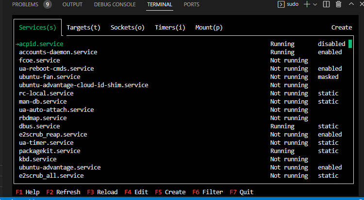
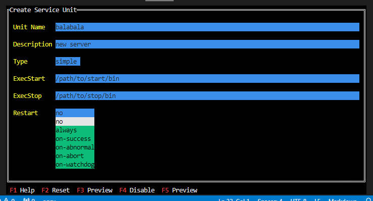
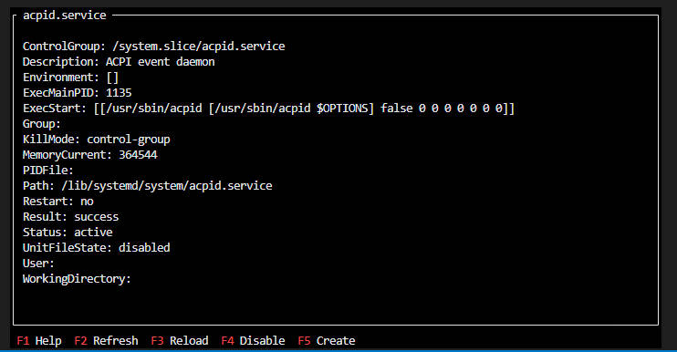

sg
===

这个一个终端的TUI程序，用于可视化的管理systemd。


### 使用说明

启动

```
sudo ./gs tui
```

按键说明
```
Shift + h / Shift + l  左右切换TAB
j / k 上下选择
PgUp / PgDn 上下翻页
Enter  选择
F1 打印帮助
F2 刷新
F3 重新加载
F4 编辑
F5 创建 ( Ctrl + N )
F6 过滤
F7 退出
```

### 效果如下



